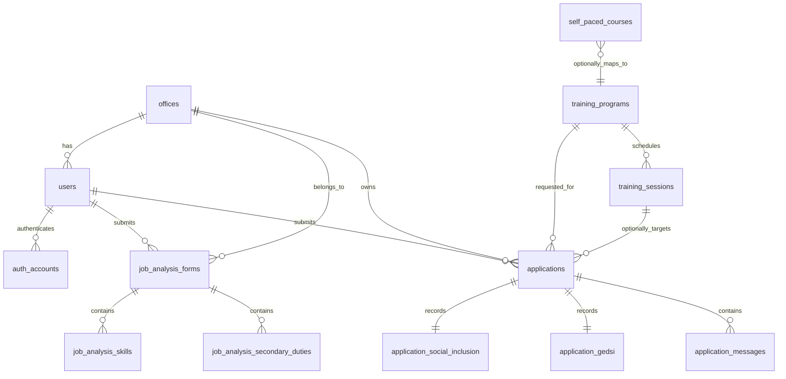

# DOTr-HRDD Turso Database Schema

## Context

The current application is a client-only Next.js portal that stores nomination workflow data in `localStorage` via [`lib/portal-data.ts`](/home/jobel/projects/jobelle-embed/lib/portal-data.ts) and [`lib/user-portal-data.ts`](/home/jobel/projects/jobelle-embed/lib/user-portal-data.ts). There are no existing API routes, so the schema below is inferred from:

- persisted nomination records and status transitions
- seeded signatory records and training catalog entries
- employee nomination form fields
- typed but not yet fully wired job analysis forms
- local credential records that imply users and roles

The design below normalizes the current frontend data so it can move cleanly into Turso without losing parity with the UI.

## ERD



## Tables

### `offices`

Business purpose: master list of DOTr offices and named office heads used by nomination and job analysis forms.

```sql
CREATE TABLE IF NOT EXISTS offices (
  id INTEGER PRIMARY KEY,
  name TEXT NOT NULL UNIQUE,
  office_head TEXT,
  created_at TEXT NOT NULL DEFAULT CURRENT_TIMESTAMP,
  updated_at TEXT NOT NULL DEFAULT CURRENT_TIMESTAMP
);
```

### `users`

Business purpose: employee and signatory directory inferred from portal credentials and nomination submitters.

```sql
CREATE TABLE IF NOT EXISTS users (
  id INTEGER PRIMARY KEY,
  username TEXT NOT NULL UNIQUE,
  full_name TEXT NOT NULL,
  email TEXT UNIQUE,
  role TEXT NOT NULL CHECK (role IN ('employee', 'signatory', 'admin')),
  office_id INTEGER REFERENCES offices(id) ON DELETE SET NULL,
  position_title TEXT,
  employee_id_number TEXT UNIQUE,
  supervisor_name TEXT,
  employment_status TEXT,
  salary_grade TEXT,
  service_length TEXT,
  contact_number TEXT,
  gender TEXT,
  date_hired TEXT,
  is_active INTEGER NOT NULL DEFAULT 1 CHECK (is_active IN (0, 1)),
  created_at TEXT NOT NULL DEFAULT CURRENT_TIMESTAMP,
  updated_at TEXT NOT NULL DEFAULT CURRENT_TIMESTAMP
);
```

### `auth_accounts`

Business purpose: local credential mapping for the current demo login model. Passwords are plain text in the current frontend demo, but production should replace this with hashed credentials and a proper auth provider.

```sql
CREATE TABLE IF NOT EXISTS auth_accounts (
  id INTEGER PRIMARY KEY,
  user_id INTEGER NOT NULL UNIQUE REFERENCES users(id) ON DELETE CASCADE,
  username TEXT NOT NULL UNIQUE,
  password_hint TEXT,
  created_at TEXT NOT NULL DEFAULT CURRENT_TIMESTAMP
);
```

### `training_programs`

Business purpose: reusable catalog for in-house, out-of-house, and self-paced learning offers displayed throughout the portal.

```sql
CREATE TABLE IF NOT EXISTS training_programs (
  id INTEGER PRIMARY KEY,
  code TEXT NOT NULL UNIQUE,
  title TEXT NOT NULL UNIQUE,
  catalog_type TEXT NOT NULL CHECK (catalog_type IN ('in-house', 'out-of-house', 'self-paced')),
  competency_type TEXT CHECK (competency_type IN ('core', 'functional', 'leadership')),
  level TEXT,
  duration_text TEXT,
  description TEXT NOT NULL,
  outline TEXT,
  target_audience TEXT,
  service_provider TEXT,
  delivery_mode TEXT,
  cost_text TEXT,
  contact_person TEXT,
  deadline_text TEXT,
  external_link TEXT,
  image_url TEXT,
  is_active INTEGER NOT NULL DEFAULT 1 CHECK (is_active IN (0, 1)),
  created_at TEXT NOT NULL DEFAULT CURRENT_TIMESTAMP,
  updated_at TEXT NOT NULL DEFAULT CURRENT_TIMESTAMP
);
```

### `training_sessions`

Business purpose: optional concrete schedule metadata for a training program. This mirrors memo-related fields shown in signatory workflows.

```sql
CREATE TABLE IF NOT EXISTS training_sessions (
  id INTEGER PRIMARY KEY,
  program_id INTEGER NOT NULL REFERENCES training_programs(id) ON DELETE CASCADE,
  start_date TEXT,
  end_date TEXT,
  session_date_text TEXT,
  venue TEXT,
  provider_name TEXT,
  memo_date TEXT,
  memo_time_in TEXT,
  memo_time_out TEXT,
  created_at TEXT NOT NULL DEFAULT CURRENT_TIMESTAMP,
  UNIQUE (program_id, session_date_text, venue)
);
```

### `applications`

Business purpose: core nomination records submitted by employees and reviewed by supervisors and signatories.

```sql
CREATE TABLE IF NOT EXISTS applications (
  id INTEGER PRIMARY KEY,
  application_number TEXT NOT NULL UNIQUE,
  applicant_user_id INTEGER REFERENCES users(id) ON DELETE SET NULL,
  office_id INTEGER REFERENCES offices(id) ON DELETE SET NULL,
  program_id INTEGER REFERENCES training_programs(id) ON DELETE SET NULL,
  session_id INTEGER REFERENCES training_sessions(id) ON DELETE SET NULL,
  form_type TEXT NOT NULL DEFAULT 'nomination' CHECK (form_type IN ('nomination', 'jaf')),
  status TEXT NOT NULL CHECK (
    status IN (
      'Pending',
      'Approved',
      'Finalized',
      'Pending Signatory',
      'Rejected',
      'Signed',
      'Supervisor Approved'
    )
  ),
  title TEXT NOT NULL,
  competency_type TEXT CHECK (competency_type IN ('core', 'functional', 'leadership')),
  date_submitted TEXT,
  date_filing TEXT,
  date_course TEXT,
  venue TEXT,
  applicant_name TEXT NOT NULL,
  applicant_username TEXT,
  employee_id_number TEXT,
  email TEXT,
  position_title TEXT,
  supervisor_name TEXT,
  office_name TEXT NOT NULL,
  office_head TEXT,
  date_hired TEXT,
  employment_status TEXT,
  salary_grade TEXT,
  service_length TEXT,
  contact_number TEXT,
  gender TEXT,
  oic_name TEXT,
  alternate_participant_json TEXT,
  justification TEXT,
  user_signature_data_url TEXT,
  admin_signature_data_url TEXT,
  memo_html TEXT,
  memo_pdf_data_url TEXT,
  memo_mode TEXT,
  memo_provider TEXT,
  memo_date TEXT,
  memo_time_in TEXT,
  memo_time_out TEXT,
  is_read INTEGER NOT NULL DEFAULT 0 CHECK (is_read IN (0, 1)),
  is_admin_read INTEGER NOT NULL DEFAULT 0 CHECK (is_admin_read IN (0, 1)),
  created_at TEXT NOT NULL DEFAULT CURRENT_TIMESTAMP,
  updated_at TEXT NOT NULL DEFAULT CURRENT_TIMESTAMP
);
```

### `application_messages`

Business purpose: audit-style threaded notes shown on application records in both employee and signatory views.

```sql
CREATE TABLE IF NOT EXISTS application_messages (
  id INTEGER PRIMARY KEY,
  application_id INTEGER NOT NULL REFERENCES applications(id) ON DELETE CASCADE,
  sender_name TEXT NOT NULL,
  message_text TEXT NOT NULL,
  is_read INTEGER NOT NULL DEFAULT 0 CHECK (is_read IN (0, 1)),
  created_at TEXT NOT NULL
);
```

### `application_gedsi`

Business purpose: accessibility and inclusion answers already modeled in `types/user-portal.ts` even though the current nomination form UI does not yet capture them.

```sql
CREATE TABLE IF NOT EXISTS application_gedsi (
  application_id INTEGER PRIMARY KEY REFERENCES applications(id) ON DELETE CASCADE,
  g1 TEXT CHECK (g1 IN ('yes', 'no')),
  g2 TEXT CHECK (g2 IN ('yes', 'no')),
  g3 TEXT CHECK (g3 IN ('yes', 'no')),
  g4 TEXT CHECK (g4 IN ('yes', 'no')),
  g5 TEXT CHECK (g5 IN ('yes', 'no')),
  g6 TEXT CHECK (g6 IN ('yes', 'no')),
  g7 TEXT CHECK (g7 IN ('yes', 'no')),
  g8 TEXT CHECK (g8 IN ('yes', 'no'))
);
```

### `application_social_inclusion`

Business purpose: companion table for the social inclusion answers defined in the frontend types.

```sql
CREATE TABLE IF NOT EXISTS application_social_inclusion (
  application_id INTEGER PRIMARY KEY REFERENCES applications(id) ON DELETE CASCADE,
  s1 TEXT CHECK (s1 IN ('yes', 'no')),
  s2 TEXT
);
```

### `job_analysis_forms`

Business purpose: future-ready storage for the competency/job-analysis workflow exposed in the employee portal UI and already defined in TypeScript types.

```sql
CREATE TABLE IF NOT EXISTS job_analysis_forms (
  id INTEGER PRIMARY KEY,
  form_number TEXT NOT NULL UNIQUE,
  submitter_user_id INTEGER REFERENCES users(id) ON DELETE SET NULL,
  office_id INTEGER REFERENCES offices(id) ON DELETE SET NULL,
  fullname TEXT NOT NULL,
  position_title TEXT,
  office_name TEXT,
  section_name TEXT,
  alternate_position TEXT,
  purpose TEXT,
  main_duties TEXT,
  tools_and_equipment TEXT,
  challenges TEXT,
  comments TEXT,
  signature_data_url TEXT,
  date_submitted TEXT,
  is_read INTEGER NOT NULL DEFAULT 0 CHECK (is_read IN (0, 1)),
  created_at TEXT NOT NULL DEFAULT CURRENT_TIMESTAMP,
  updated_at TEXT NOT NULL DEFAULT CURRENT_TIMESTAMP
);
```

### `job_analysis_secondary_duties`

Business purpose: repeating list of duty-frequency rows for job analysis forms.

```sql
CREATE TABLE IF NOT EXISTS job_analysis_secondary_duties (
  id INTEGER PRIMARY KEY,
  job_analysis_form_id INTEGER NOT NULL REFERENCES job_analysis_forms(id) ON DELETE CASCADE,
  duty_text TEXT NOT NULL,
  frequency_text TEXT,
  sort_order INTEGER NOT NULL DEFAULT 0
);
```

### `job_analysis_skills`

Business purpose: repeating list of skill-level rows for job analysis forms.

```sql
CREATE TABLE IF NOT EXISTS job_analysis_skills (
  id INTEGER PRIMARY KEY,
  job_analysis_form_id INTEGER NOT NULL REFERENCES job_analysis_forms(id) ON DELETE CASCADE,
  skill_name TEXT NOT NULL,
  level_text TEXT,
  sort_order INTEGER NOT NULL DEFAULT 0
);
```

### `self_paced_courses`

Business purpose: richer course metadata for the dedicated self-paced portal, including ratings and syllabus-style discovery content.

```sql
CREATE TABLE IF NOT EXISTS self_paced_courses (
  id INTEGER PRIMARY KEY,
  program_id INTEGER UNIQUE REFERENCES training_programs(id) ON DELETE SET NULL,
  slug TEXT NOT NULL UNIQUE,
  title TEXT NOT NULL UNIQUE,
  category TEXT NOT NULL,
  level TEXT NOT NULL,
  duration_text TEXT NOT NULL,
  rating REAL NOT NULL,
  reviews_text TEXT NOT NULL,
  learners_text TEXT NOT NULL,
  price_text TEXT NOT NULL,
  badge TEXT,
  image_url TEXT,
  external_link TEXT,
  instructor_name TEXT NOT NULL,
  instructor_role TEXT NOT NULL,
  instructor_bio TEXT NOT NULL,
  outcomes_json TEXT NOT NULL,
  syllabus_json TEXT NOT NULL,
  created_at TEXT NOT NULL DEFAULT CURRENT_TIMESTAMP,
  updated_at TEXT NOT NULL DEFAULT CURRENT_TIMESTAMP
);
```

## Indexing Strategy

```sql
CREATE INDEX IF NOT EXISTS idx_users_office_id ON users(office_id);
CREATE INDEX IF NOT EXISTS idx_training_programs_catalog_type ON training_programs(catalog_type);
CREATE INDEX IF NOT EXISTS idx_training_sessions_program_id ON training_sessions(program_id);
CREATE INDEX IF NOT EXISTS idx_applications_status ON applications(status);
CREATE INDEX IF NOT EXISTS idx_applications_title ON applications(title);
CREATE INDEX IF NOT EXISTS idx_applications_applicant_user_id ON applications(applicant_user_id);
CREATE INDEX IF NOT EXISTS idx_applications_office_id ON applications(office_id);
CREATE INDEX IF NOT EXISTS idx_applications_form_type_status ON applications(form_type, status);
CREATE INDEX IF NOT EXISTS idx_applications_date_submitted ON applications(date_submitted);
CREATE INDEX IF NOT EXISTS idx_application_messages_application_id ON application_messages(application_id);
CREATE INDEX IF NOT EXISTS idx_job_analysis_forms_submitter_user_id ON job_analysis_forms(submitter_user_id);
CREATE INDEX IF NOT EXISTS idx_job_analysis_forms_office_id ON job_analysis_forms(office_id);
CREATE INDEX IF NOT EXISTS idx_self_paced_courses_category ON self_paced_courses(category);
CREATE INDEX IF NOT EXISTS idx_self_paced_courses_level ON self_paced_courses(level);
```

Why these indexes matter:

- signatory dashboards filter heavily by `status`, `form_type`, and grouped `title`
- employee notifications derive from user-submitted applications and job analysis forms
- training pages browse by `catalog_type`, `category`, and `level`
- related child rows need fast lookups by foreign key

## Notes On Inference

- `applications` is the main operational table. This is certain because both signatory and employee workflows revolve around it.
- `job_analysis_forms` is included even though submission is not yet wired, because the UI and types already define the structure and signatory filtering explicitly reserves `formType = 'jaf'`.
- `application_gedsi` and `application_social_inclusion` are modeled separately because the TypeScript shape already treats them as nested sub-objects with fixed fields.
- `auth_accounts` is intentionally minimal because the current app only demonstrates client-side demo credentials.
